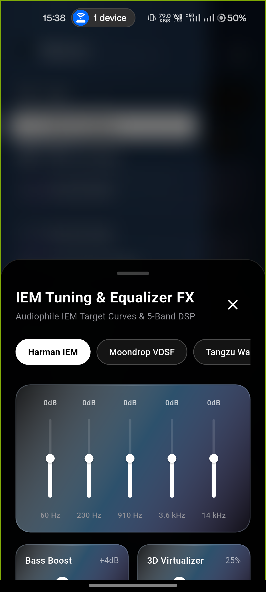

<p align="center">
  
</p>

<h1 align="center">NOCTRA</h1>

<p align="center">
  <b>Autonomous, Privacy-Sovereign, Audiophile-Grade Music Streaming & Intelligence Platform</b>
</p>

<p align="center">
  <a href="https://github.com/nomad-guy/Noctra/releases/tag/v1.0.4"></a>
  <a href="LICENSE"></a>
  <a href="#privacy-architecture"></a>
  <a href="#features"></a>
  <a href="#automated-verification"></a>
  <a href="#codebase-architecture"></a>
  <a href="https://flutter.dev"></a>
</p>

<p align="center">
  <a href="#overview">Overview</a> &bull;
  <a href="#screenshots">Screenshots</a> &bull;
  <a href="#features">Features</a> &bull;
  <a href="#download">Download</a> &bull;
  <a href="#architecture">Architecture</a> &bull;
  <a href="#build-from-source">Build</a> &bull;
  <a href="#faq">FAQ</a> &bull;
  <a href="CHANGELOG.md">Changelog</a>
</p>

---

## Overview

Noctra is an authentication-less, privacy-first audiophile music streaming client engineered for Android. Built with Flutter, Dart, Riverpod, and native Android Kotlin digital signal processing delegates, Noctra streams pure lossless FLAC audio up to **24-bit/192 kHz**, synchronizes bilingual lyrics with elegant translation subtitles, and executes taste vector embeddings and recommendations entirely on-device without telemetry, accounts, or cloud relays.

---

## Screenshots

<table align="center">
  <tr>
    <td align="center" width="33%">
      <br />
      <b>Discovery & Charts</b>
    </td>
    <td align="center" width="33%">
      <br />
      <b>Hi-Res Player & Telemetry</b>
    </td>
    <td align="center" width="33%">
      <br />
      <b>Bilingual Lyrics & Subtitles</b>
    </td>
  </tr>
  <tr>
    <td align="center" width="33%">
      <br />
      <b>Search & Catalog Explorer</b>
    </td>
    <td align="center" width="33%">
      <br />
      <b>Audiophile IEM DSP Curves</b>
    </td>
    <td align="center" width="33%">
      <br />
      <b>Triple Noir & App Icons</b>
    </td>
  </tr>
</table>

---

## Features

- **Hi-Res & Lossless FLAC Audio**: Bit-perfect uncompressed streaming up to 24-bit / 192 kHz straight to your DAC with live codec, sample rate, and bit depth telemetry.
- **Multi-Tier Stream Resolution**: Automated fallback pipeline prioritizing pristine FLAC streams (Deezer Hi-Fi, Qobuz Studio) with seamless Opus 160kbps resilience.
- **Bilingual Synchronized Lyrics & Subtitles**: Intelligent timestamp consolidation merges simultaneous multi-language lyric lines from LRCLIB into primary sung text with dimmed italic English translation subtitles (Apple Music & Spotify style).
- **AksharaEngine Script Transliteration**: 100% offline, zero-latency phonetic script transliteration supporting Devanagari (Hindi), Gurmukhi (Punjabi), Urdu, and Latin/IAST.
- **Audiophile IEM Target Curves**: Integrated target frequency response curves (Harman IEM, Moondrop VDSF, Tangzu Wan'er) combined with a 5-band hardware DSP equalizer and bass boost.
- **Spatial Audio & 3D Virtualizer**: Soundstage widening with Concert acoustic resonance presets and Dolby Atmos spatial audio detection badges.
- **Autonomous AI Sound Studio**: On-device vector embeddings, 8-axis acoustic DNA radar (Energy, Valence, Danceability, Acousticness), and mood-driven playlist generation.
- **Triple Noir Design System**:
  - **Noir Black**: Obsidian glassmorphism with `#0A0A0A` depth and specular fluid borders.
  - **Noir White**: Editorial monochrome high-contrast surfaces for outdoor visibility.
  - **Liquid Glass**: Sapphire optical refraction (`#162E4A`) with hardware-accelerated shaders.
  - Dynamic Android launcher icon synchronization matching the active in-app theme.
- **SyncCast Party Mode**: Low-latency multi-device audio streaming across local Wi-Fi without external servers.
- **Zero-Knowledge Privacy**: No accounts, emails, phone numbers, or OAuth logins. Playback history, search queries, and tastes remain permanently on local encrypted SQLite storage.

---

## Download

Direct binary releases for version **v1.0.4**. Every artifact is compiled with ProGuard and R8 bytecode optimization.

```text
Noctra-1.0.4-arm64-v8a.apk   (22.9 MB) — Recommended for modern 64-bit Android devices (Android 8.0+)
Noctra-1.0.4-universal.apk   (63.2 MB) — Universal multi-ABI compatibility
Noctra-1.0.4-armeabi-v7a.apk (20.9 MB) — Legacy 32-bit ARM devices
Noctra-1.0.4-x86_64.apk      (24.4 MB) — Emulators and x86_64 Chromebooks / tablets
```

### Artifact Manifest

| Package | Architecture | Direct Download | SHA-256 Digest |
| :--- | :--- | :--- | :--- |
| `Noctra-1.0.4-arm64-v8a.apk` | `arm64-v8a` | [Download](https://github.com/nomad-guy/Noctra/releases/download/v1.0.4/Noctra-1.0.4-arm64-v8a.apk) | `545024a2e4dc4389fe5cc1e1d1b470165523fd3ad942178d0093687639d656aa` |
| `Noctra-1.0.4-universal.apk` | Universal | [Download](https://github.com/nomad-guy/Noctra/releases/download/v1.0.4/Noctra-1.0.4-universal.apk) | `ee7558a611a95432f6d52102d9283ca6bd0e572b46d4e3e3b07bb58dd5b8647f` |
| `Noctra-1.0.4-armeabi-v7a.apk` | `armeabi-v7a` | [Download](https://github.com/nomad-guy/Noctra/releases/download/v1.0.4/Noctra-1.0.4-armeabi-v7a.apk) | `437a000c29bdddc56d178ef2d1edfabc0c9f75b1f220c8f33e2ca37b69dee98d` |
| `Noctra-1.0.4-x86_64.apk` | `x86_64` | [Download](https://github.com/nomad-guy/Noctra/releases/download/v1.0.4/Noctra-1.0.4-x86_64.apk) | `90762d2f40f4fbd76d03aaa1352894b6f75fb04e6c8d300ba6e6f16530078203` |

### Integrity Verification

Verify all downloaded binaries against the official checksum manifest:
```bash
sha256sum -c SHA256SUMS.txt
```

---

## Architecture

Noctra adheres to a strict modular architectural rule where **no single source file in `lib/` exceeds 300 lines of code (LOC)**.

```text
noctra/
├── lib/
│   ├── core/
│   │   ├── constants/            # Design tokens, storage keys & audio constants
│   │   ├── theme/                # Triple Noir design tokens (Black, White, Liquid Glass)
│   │   └── utils/                # Localization (L10n), sanitizers, formatting
│   ├── data/
│   │   ├── models/               # Immutable models (Song, Album, Artist, StreamInfo)
│   │   └── repositories/         # SQLite persistence & taste vector database
│   ├── providers/                # Riverpod state management & audio service controllers
│   ├── services/
│   │   ├── audio/                # JustAudio player engine, DSP, & telemetry
│   │   ├── lyrics/               # LRCLIB, consolidation engine, & Akshara transliteration
│   │   ├── stream/               # Multi-tier stream resolution (FLAC / Opus)
│   │   └── sync/                 # SyncCast local Wi-Fi broadcasting
│   └── ui/
│       ├── screens/              # Core screens (Home, Search, Player, Library, AI Studio)
│       └── widgets/              # Reusable UI components, visualizers & lyrics views
└── android/                      # Kotlin DSP delegates, AudioFX visualizers & icon aliases
```

---

## Build from Source

### Prerequisites
- **Flutter SDK**: `^3.47.0` (Dart `^3.4.0`)
- **Android SDK**: API Level 36 (`compileSdk = 36`, `minSdk = 26`)
- **Java**: OpenJDK 17

### 1. Clone the Repository
```bash
git clone https://github.com/nomad-guy/Noctra.git
cd Noctra
```

### 2. Fetch Dependencies
```bash
flutter pub get
```

### 3. Run Automated Quality Suite
```bash
flutter analyze
flutter test
flutter test test/architecture_boundaries_test.dart
```

### 4. Build Release Artifacts
```bash
# Build optimized split APKs per ABI (recommended)
flutter build apk --split-per-abi --release

# Build universal APK
flutter build apk --release
```

Compiled binaries will be generated in `build/app/outputs/flutter-apk/`.

---

## FAQ

#### Do I need an account to use Noctra?
No. Noctra does not possess user accounts, passwords, or emails. All playlists, favorites, and listening graphs are preserved locally in an encrypted database on your device.

#### Is playback really lossless?
Yes. Noctra prioritizes pure, uncompressed FLAC streams up to 24-bit/192 kHz. When connected to a DAC or supported audio device, the player displays live bit depth and sample rate telemetry.

#### How do bilingual lyrics work?
When an LRC file contains simultaneous dual-language lines (such as Romanized Hindi alongside an English translation), Noctra consolidates them into a single line: the vocal line takes primary focus, while the English translation displays beneath it as a subtle italicized subtitle.

#### Where are downloaded songs stored?
Downloaded tracks are saved to your chosen storage directory (`/storage/emulated/0/Music/Noctra/` by default) with embedded high-resolution artwork and metadata tags.

#### Does Noctra support background and lock-screen playback?
Yes. Noctra integrates directly with Android's `MediaSessionCompat` and foreground audio service, providing full playback controls, seekbars, and artwork on your lock screen and notification shade.

---

## Contributing

Contributions are welcome! Please ensure:
1. All modified or newly added Dart files in `lib/` strictly stay **$\le 300$ lines of code**.
2. Run `flutter analyze` and confirm 0 issues.
3. Ensure all unit and integration tests pass before submitting a pull request.

---

## Legal Notice & Statutory Compliance

Noctra is distributed as open-source software strictly for personal, educational, and research purposes. Noctra does not host, store, index, or distribute copyright-protected audio files on central servers. All stream resolution and media fetching operate as client-side user agents interacting directly with publicly accessible endpoints. Users remain solely responsible for ensuring compliance with applicable regional intellectual property laws and service terms.

---

<p align="center">
  <b>Noctra</b> &bull; Crafted with precision for pure acoustic freedom.
</p>
