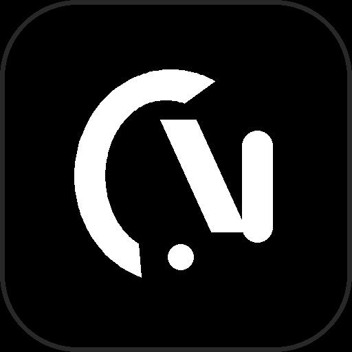

<div align="center">



# NOCTRA

### Autonomous, Privacy-First and Free Music Intelligence Platform

[](https://www.gnu.org/licenses/gpl-3.0)
[](#license)
[](#privacy-first-and-free-to-use)
[](#privacy-first-and-free-to-use)
[](https://flutter.dev)

<p align="center">
  <b>Noctra</b> is a high-fidelity music streaming client engineered for audiophiles and privacy purists.<br/>
  Powered by an <b>on-device two-stage neural recommender (MLP + MMR)</b>, <b>SQLite telemetry</b>, <b>hardware-accelerated DSP audio effects</b>, and a dual <b>Noir liquid-glass aesthetic</b>.
</p>

[Download Latest APK](https://github.com/nomad-guy/Noctra/releases/latest) | [Report an Issue](https://github.com/nomad-guy/Noctra/issues) | [Changelog](CHANGELOG.md) | [Legal Policy](#strict-legal-disclaimer-and-compliance-policy)

</div>

---

## Privacy-First and Free to Use

Noctra is built on the core principle that listening to music should be private, ad-free, and accessible without compromise.

- **100% Free to Use**: No subscriptions, no paywalls, no in-app purchases, and no artificial feature restrictions.
- **Zero Advertisements**: Uninterrupted, gapless playback without commercial interruptions or audio interstitials.
- **Authentication-Less**: No accounts, emails, phone numbers, or passwords required.
- **Zero Cloud Telemetry**: Listening history, taste profiles, and usage habits never leave the physical device. All data is persisted locally in an on-device SQLite database.

---

## Noir Design System and Theme Styles

Noctra features a bespoke visual language inspired by modernist editorial typography and dark minimalism.

### 1. Noir Obsidian Dark
The signature interface style utilizing layered liquid glassmorphism, 18px surface radii, subtle backdrop blur filters, and specular border highlights that react dynamically to system illumination.

### 2. AMOLED Pitch-Black
A true `#000000` dark interface engineered for organic LED panels. Every secondary background token is set to absolute black, delivering zero battery draw during extended playback sessions.

### 3. Editorial Minimal Light
A high-contrast monochrome light theme featuring sharp typography, clean borders, and soft daylight gradients designed for high-glare environments.

### 4. Dynamic Launcher Icon Synchronization
The Android launcher icon automatically synchronizes with the active in-app theme style, toggling between Obsidian Dark and Editorial Light iconography without requiring an application restart.

---

## Core Engineering Features

### 1. On-Device Neural Recommendation Engine
- **Stage 1 (Candidate Retrieval)**: Dynamically extracts ~100 candidate tracks across local SQLite history, curated libraries, and live charts.
- **Stage 2 (Tiny Neural MLP Ranker)**: A 3-layer Dense Neural Network (80 -> 32 -> 16 -> 1) evaluates user embeddings, track acoustic vectors, and contextual features to compute engagement probability in under 1 millisecond.
- **Stage 3 (Maximal Marginal Relevance Diversity Filter)**: MMR reranking (lambda = 0.75) with strict frequency caps eliminates recommendation fatigue by preventing repeat artists.
- **Online Behavioral Gradient Learning**: Dynamically recalibrates user taste vectors in real time based on micro-interactions (-1.0 for fast skips, +1.0 for completions, +1.5 for replays, +3.0 for favorites) with a 14-day exponential half-life recency decay.

### 2. Audiophile Sound Core and Hardware DSP
- **Lossless 320kbps Audio**: Direct resolution of bit-perfect CD quality streams on-device.
- **Native Android Hardware DSP**: 5-band millibel Equalizer mapped directly to native Android audiofx sessions.
- **Studio Master Modes**: Instant hardware presets for 3D Spatial Virtualizer, Concert Hall Reverb, and BassBoost Exciter.

### 3. Synchronized Lyrics and Dynamic Discovery
- **Millisecond-Accurate Synced Lyrics**: Time-coded LRC synchronization with Roman-to-Devanagari transliteration support.
- **100% Dynamic Artist Discovery**: Direct Wikipedia REST API integration resolving high-resolution portraits and biographical summaries with zero static defaults.
- **Spotify-Style Onboarding**: Multi-step first-run selector for Languages, Genres, and Artists to seed initial taste vectors.

### 4. Decentralized P2P SyncCast
- Local-network party playback synchronization using a low-latency WebSocket protocol with automatic socket reconnection and zero cloud server dependencies.

---

## Recommendation Engine Data Flow

```text
+----------------------------------------------------------+
|                   USER LISTENING EVENTS                  |
|  Fast Skip (-1.0) | Partial (+0.4) | Full (+1.0) | Fav (+3.0)  |
+----------------------------+-----------------------------+
                             |
                             v
+----------------------------------------------------------+
|         ON-DEVICE IMPLICIT SIGNAL TRACKER (SQLITE)       |
|       U_new = normalize(U_old + alpha * signal * T)      |
|          with Half-Life Recency Decay (tau = 14d)        |
+----------------------------+-----------------------------+
                             |
                             v
+----------------------------------------------------------+
|             STAGE 1: CANDIDATE GENERATOR                 |
|    Retrieves ~100 tracks from Library + Trends + Charts  |
+----------------------------+-----------------------------+
                             |
                             v
+----------------------------------------------------------+
|             STAGE 2: ON-DEVICE TINY MLP RANKER           |
|   Input: [User (32) + Track (32) + Context (16)] (80d)   |
|             Dense 80 -> 32 -> 1 (Sigmoid Score)          |
+----------------------------+-----------------------------+
                             |
                             v
+----------------------------------------------------------+
|             STAGE 3: MMR DIVERSITY RERANKER              |
|       Selects Top 15-20 Tracks with Artist Diversity      |
+----------------------------------------------------------+
```

---

## Building from Source

### Prerequisites
- Flutter SDK (v3.24.0 or higher)
- Android SDK (API Level 24 to 35)
- Java 17 / OpenJDK 17

### Build Commands
```bash
# Clone the repository
git clone https://github.com/nomad-guy/Noctra.git
cd Noctra

# Install dependencies
flutter pub get

# Run unit tests (10/10 passing)
flutter test

# Run static code analysis
flutter analyze

# Compile release APK
flutter build apk --release
```

---

## Strict Legal Disclaimer and Compliance Policy

Please read this section carefully before downloading, compiling, or using Noctra.

### 1. Client-Side Architecture and Zero Media Hosting
Noctra operates strictly as a client-side media browser, parser, and player.
- Noctra does not own, host, store, cache on remote servers, re-encode, or redistribute any copyrighted music, audio streams, lyrics, or video files.
- All media stream URLs, lyric timestamps, Wikipedia biographical extracts, and metadata are queried, fetched, and parsed purely on the end-user's local device from public web endpoints upon explicit user request.

### 2. Non-Commercial and Research Purpose
Noctra is developed and distributed solely as a Free and Open Source Software (FOSS) educational and research project demonstrating:
- Client-side on-device neural network ranking without server telemetry.
- Hardware-level digital signal processing on mobile operating systems.
- Decentralized peer-to-peer clock synchronization over local networks.

The maintainers do not monetize, sell, license, or profit from the operation of this application in any manner.

### 3. Trademark and Intellectual Property Disclaimers
- All product names, logos, brand names, trademarks, and registered trademarks (including Spotify, YouTube, YouTube Music, JioSaavn, Wikipedia, and others) are the property of their respective trademark holders.
- The use of these names and marks within the codebase, documentation, or user interface is strictly for nominal identification, reference, and technical interoperability purposes under Fair Use. Noctra is not affiliated with, endorsed by, sponsored by, or associated with any of these entities.

### 4. End-User Compliance and Responsibility
- End users are solely responsible for ensuring that their use of Noctra complies with applicable copyright laws, intellectual property regulations, and the terms of service of third-party platforms in their respective legal jurisdictions.
- The developers and contributors of Noctra disclaim any responsibility or legal liability for unauthorized use, misuse, copyright infringement, or violations of third-party platform terms by end users.

### 5. Disclaimer of Warranty and Limitation of Liability
THIS SOFTWARE IS PROVIDED BY THE COPYRIGHT HOLDERS AND CONTRIBUTORS "AS IS" AND ANY EXPRESS OR IMPLIED WARRANTIES, INCLUDING, BUT NOT LIMITED TO, THE IMPLIED WARRANTIES OF MERCHANTABILITY, FITNESS FOR A PARTICULAR PURPOSE, AND NON-INFRINGEMENT ARE DISCLAIMED. IN NO EVENT SHALL THE COPYRIGHT OWNER OR CONTRIBUTORS BE LIABLE FOR ANY DIRECT, INDIRECT, INCIDENTAL, SPECIAL, EXEMPLARY, OR CONSEQUENTIAL DAMAGES ARISING IN ANY WAY OUT OF THE USE OF THIS SOFTWARE, EVEN IF ADVISED OF THE POSSIBILITY OF SUCH DAMAGE.

---

## License

Copyright (C) 2026 Nomad Guy

This project is Free and Open Source Software released under the **GNU General Public License v3.0 (GPL-3.0)**.  
You are free to run, study, modify, and redistribute this software in accordance with the terms of the license.

Full license text is available in the [LICENSE](LICENSE) file.

---

<div align="center">
  <sub>Crafted with engineering discipline and privacy by <b>Nomad Guy</b> • <a href="https://github.com/nomad-guy">@nomad-guy</a></sub>
</div>
