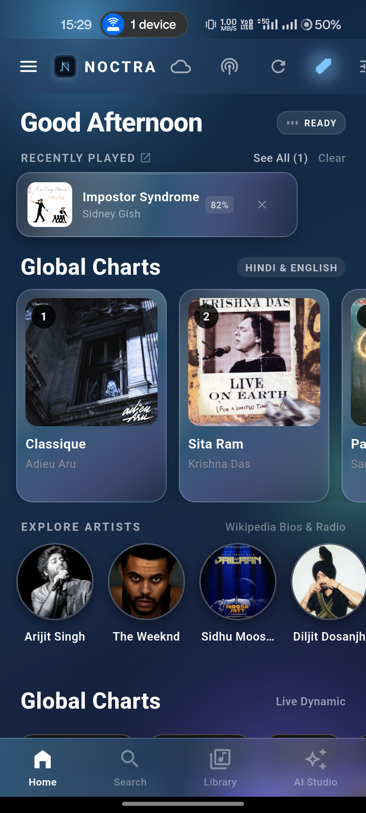
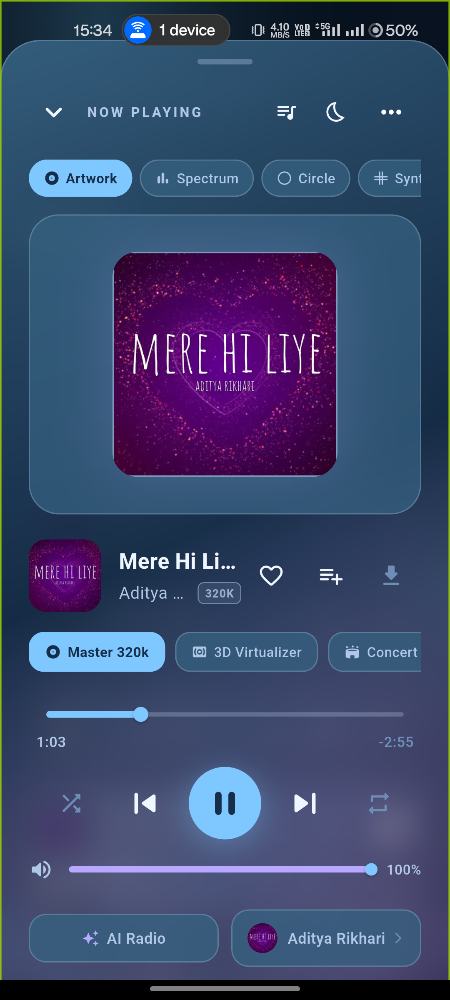
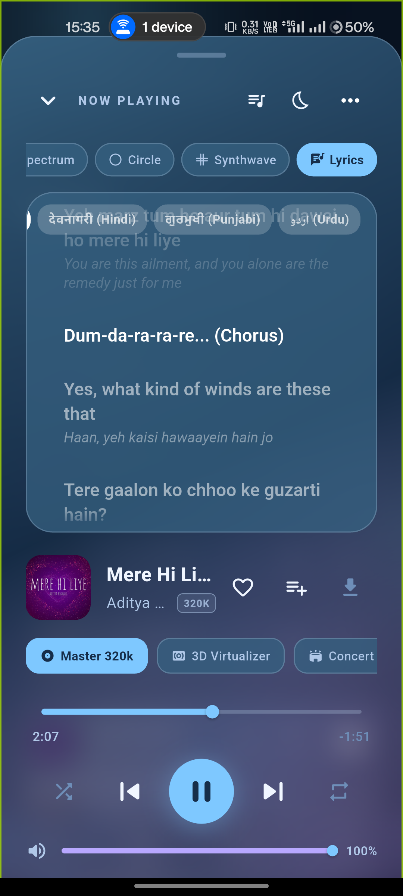
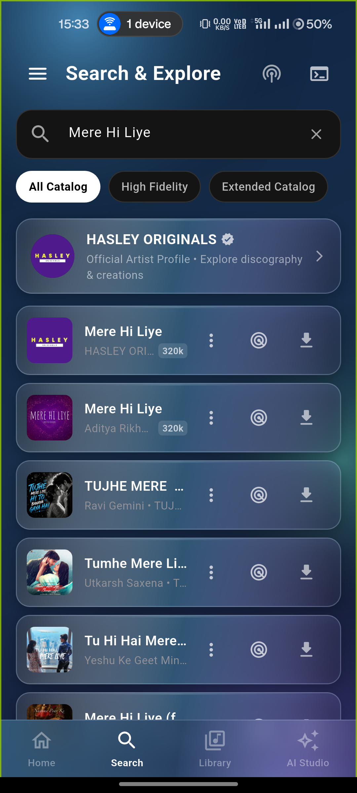
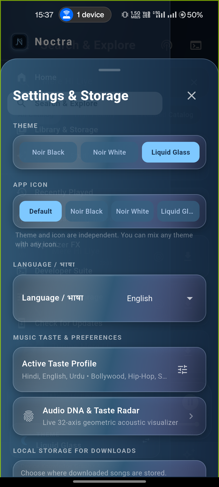

<p align="center">
  
</p>

<h1 align="center">Noctra</h1>

<p align="center">
  <b>Autonomous, Privacy-Sovereign, Audiophile-Grade Cross-Platform Music Client</b><br />
  Lossless 24-bit/192kHz audio streaming &bull; Neural taste vectors &bull; Consolidated bilingual lyrics &bull; Zero telemetry
</p>

<p align="center">
  <a href="https://github.com/nomad-guy/Noctra/releases/latest"></a>
  <a href="LICENSE"></a>
  <a href="SECURITY.md"></a>
  <a href="#privacy-architecture"></a>
  <a href="#streaming--audiophile-playback"></a>
  <a href="#automated-verification"></a>
  <a href="#codebase-architecture"></a>
  <a href="https://flutter.dev"></a>
</p>

<p align="center">
  <a href="#overview">Overview</a> &bull;
  <a href="#screenshots">Screenshots</a> &bull;
  <a href="#features">Features</a> &bull;
  <a href="#installation--downloads">Downloads</a> &bull;
  <a href="#architecture">Architecture</a> &bull;
  <a href="#building-from-source">Build from Source</a> &bull;
  <a href="CODE_OF_CONDUCT.md">Code of Conduct</a> &bull;
  <a href="CONTRIBUTING.md">Contributing</a> &bull;
  <a href="SECURITY.md">Security</a> &bull;
  <a href="CHANGELOG.md">Changelog</a> &bull;
  <a href="#legal-disclaimer--terms-of-use">Legal Disclaimer</a>
</p>

---

## Overview

**Noctra** is an authentication-less, privacy-first audiophile music streaming client engineered for **Android, Windows, Linux, and iOS**.

Built with Flutter, Dart, Riverpod, and native platform digital signal processing delegates, Noctra streams pure lossless FLAC audio up to **24-bit/192 kHz**, synchronizes bilingual lyrics with elegant translation subtitles, executes on-device neural taste vector recommendations, and packages into single-file native installers (`.exe`, `.deb`, `.apk`, `.ipa`) without accounts, tracking, or cloud relays.

---

## Screenshots

<table align="center">
  <tr>
    <td align="center" width="33%">
      <br />
      <b>Discovery & Trending Feeds</b>
    </td>
    <td align="center" width="33%">
      <br />
      <b>Hi-Res Player & Audio Telemetry</b>
    </td>
    <td align="center" width="33%">
      <br />
      <b>Bilingual Lyrics & Subtitles</b>
    </td>
  </tr>
  <tr>
    <td align="center" width="33%">
      <br />
      <b>Search & Catalog Explorer</b>
    </td>
    <td align="center" width="33%">
      <br />
      <b>Play Queue & Swipe Actions</b>
    </td>
    <td align="center" width="33%">
      <br />
      <b>DSP Equalizer & Audio DNA</b>
    </td>
  </tr>
</table>

---

## Table of Contents

- [Overview](#overview)
- [Screenshots](#screenshots)
- [What's New in v1.0.5](#whats-new-in-v105)
- [Features](#features)
  - [Streaming & Audiophile Playback](#streaming--audiophile-playback)
  - [Discovery & Neural Taste Engine](#discovery--neural-taste-engine)
  - [Synced Bilingual Lyrics & Transliteration](#synced-bilingual-lyrics--transliteration)
  - [Playlist Management & Universal Transfer](#playlist-management--universal-transfer)
  - [Triple Noir Aesthetic & Customization](#triple-noir-aesthetic--customization)
- [Installation & Downloads](#installation--downloads)
- [Architecture](#architecture)
- [Building from Source](#building-from-source)
- [Special Thanks](#special-thanks)
- [Legal Disclaimer & Terms of Use](#legal-disclaimer--terms-of-use)

---

## What's New in v1.0.5

- **Cross-Platform Native Packaging**:
  - **Windows**: Single-file standalone `Noctra-1.0.5-Setup-x64.exe` installer compiled with Inno Setup.
  - **Linux**: Native Debian/Ubuntu package (`noctra_1.0.5_amd64.deb`) with system icons and desktop entry.
  - **Android**: Universal APK, Split-ABI APKs (`arm64-v8a`, `armeabi-v7a`, `x86_64`), and Google Play App Bundle (`.aab`).
  - **iOS**: Sideloadable `Noctra-1.0.5.ipa` bundle ready for AltStore, SideStore, Sideloadly, and TrollStore.
- **Shuffle & Algorithmic Remix for Folders**:
  - Integrated `AiCollectionActionBar` into all imported playlists and custom folders with 1-tap random shuffle and deterministic remix reordering persisted directly to the local SQLite database.
- **Universal Playlist & Library Transfer Protocol**:
  - Pure-Dart `NoctraTransferService` supporting lossless JSON manifest (`.noctra.json`) and spreadsheet-compatible universal CSV (`.csv`) export and import with 1-tap clipboard copying and downloads file saving.
- **Build Hardening**:
  - Silenced MSVC `STL1011` coroutine deprecation static assertions on Windows runners and added graceful debug keystore fallback for CI environments.

---

## Features

### Streaming & Audiophile Playback
- **Pure Lossless FLAC up to 24-bit/192kHz**: Automatic priority resolution for uncompressed studio master streams.
- **Real-Time Audio Telemetry**: Instant live readout of active bit depth ($16\text{-bit} / 24\text{-bit}$) and sample rate ($44.1\,\text{kHz} - 192\,\text{kHz}$) directly in the player header.
- **5-Band DSP Equalizer Suite**: Built-in audiophile presets including target curves for Harman IEM, Moondrop VDSF, and Tangzu Wan'er.
- **Spatial Audio & 3D Virtualizer**: Acoustic resonance simulation with Concert, Studio, and Dolby Atmos virtualized soundstage.
- **Seamless Gapless Crossfade**: Configurable crossfade ramp engine with linear and logarithmic decay curves.
- **Smart Speed & Pitch FX**: Granular 0.5x to 2.0x playback rate adjustment with time-stretching, plus 1-tap presets (Slowed 0.85x, Chill 0.90x, Nightcore 1.25x).

### Discovery & Neural Taste Engine
- **On-Device Neural Taste Recommender**: 4-layer multi-layer perceptron (120 input dimensions) modeling acoustic valence, energy, danceability, and listening velocity on-device without cloud telemetry.
- **Audio DNA Radar Visualizer**: Interactive multi-polygon radar mapping 8 acoustic traits and classifying user habits into archetypes (e.g. *Cyber Synth Architect*, *Nocturnal Dreamer*).
- **AI Radio & Seed Mixes**: Infinite algorithmic radio stations generated from any seed track without duplicate loops.

### Synced Bilingual Lyrics & Transliteration
- **Apple Music / Spotify Style Bilingual Subtitles**: Consolidated line matching merges dual-language LRC lines into primary vocals with synchronized translation subtitles.
- **AksharaEngine Offline Transliteration**: Synchronous, zero-latency phonetic script transliteration supporting Devanagari, Gurmukhi, Urdu, Bengali, Tamil, Telugu, Kannada, Malayalam, Gujarati, Odia, and Romanized Latin.
- **Multi-Script Selector**: Horizontally scrollable chip selector to switch script views dynamically on the fly.

### Playlist Management & Universal Transfer
- **Universal URL Importer**: 1-tap import from Spotify playlists, YouTube playlists, and plaintext tracklists.
- **Lossless Manifest Export**: Export and share playlists via JSON manifest (`.noctra.json`) or universal CSV format (`.csv`).
- **Shuffle & Remix**: Instant algorithmic remix reordering for any custom or imported playlist.
- **Swipe Gestures**: Swipe right to Play Next (Cyan), swipe left to Add to Queue (Amber) with tactile haptic feedback.

### Triple Noir Aesthetic & Customization
- **Curated Noir Design System**:
  - **Noir Black**: Deep obsidian glass with high-contrast typography.
  - **Noir White**: Minimalist editorial day mode with soft parchment grays.
  - **Liquid Glass**: Translucent sapphire blur glassmorphism with dynamic specular borders.
- **Dynamic Theme-Aware Launcher Icons**: Automatically updates the Android home screen launcher icon to match your active theme.

---

## Installation & Downloads

Pre-compiled production binaries for all operating systems are available on the [**Releases Page**](https://github.com/nomad-guy/Noctra/releases/latest):

| Operating System | Package Name | Target Architecture | Installation Guide |
|---|---|---|---|
| **Windows** | `Noctra-1.0.5-Setup-x64.exe` | x86_64 / x64 | Run installer &bull; Installs to `AppData` with Desktop shortcut |
| **Linux** | `noctra_1.0.5_amd64.deb` | x86_64 / amd64 | Run `sudo dpkg -i noctra_1.0.5_amd64.deb` |
| **Android** | `Noctra-1.0.5-Universal.apk` | All Devices | Install on any Android 8.0+ device |
| **Android (Optimized)** | `Noctra-1.0.5-arm64-v8a.apk` | 64-bit Mobile | Smallest file size for modern 64-bit phones |
| **Android (Play Store)** | `Noctra-1.0.5.aab` | Google Play | Android App Bundle for store distribution |
| **iOS** | `Noctra-1.0.5.ipa` | ARM64 / iPhone & iPad | Sideload via [AltStore](https://altstore.io/), [SideStore](https://sidestore.io/), or [TrollStore](https://github.com/opa334/TrollStore) |

> **Verification**: Every release includes `SHA256SUMS.txt` to cryptographically verify binary integrity.

---

## Architecture

Noctra strictly enforces an architectural invariant: **no single source file in `lib/` exceeds 300 lines of code (LOC)**.

```text
noctra/
├── lib/
│   ├── core/
│   │   ├── constants/            # Design tokens, storage keys & audio constants
│   │   ├── theme/                # Triple Noir design tokens (Black, White, Liquid Glass)
│   │   └── utils/                # Localization (L10n), sanitizers, formatting
│   ├── data/
│   │   ├── models/               # Immutable models (Song, Album, Artist, StreamInfo)
│   │   └── repositories/         # SQLite persistence & taste vector database
│   ├── providers/                # Riverpod state management & audio controllers
│   ├── services/
│   │   ├── audio/                # JustAudio player engine, DSP, & telemetry
│   │   ├── lyrics/               # LRCLIB, consolidation engine, & Akshara transliteration
│   │   ├── migration/            # NoctraTransferService & CSV/JSON serialization
│   │   ├── stream/               # Multi-tier stream resolution (FLAC / Opus)
│   │   └── sync/                 # SyncCast local Wi-Fi broadcasting
│   └── ui/
│       ├── screens/              # Core screens (Home, Search, Player, Library, Settings)
│       └── widgets/              # Reusable UI components, visualizers & lyrics views
├── android/                      # Kotlin DSP delegates, AudioFX visualizers & icon aliases
├── windows/                      # CMake build scripts & Inno Setup installer packaging
└── linux/                        # Native Linux GTK desktop runner & Debian packaging
```

---

## Building from Source

### Prerequisites
- [Flutter SDK](https://flutter.dev/docs/get-started/install) (`>= 3.24.0` / Stable channel)
- Java JDK 17
- Platform toolchains:
  - **Android**: Android Studio & Android SDK 36
  - **Windows**: Visual Studio 2022 C++ Desktop Development & Inno Setup 6
  - **Linux**: `clang`, `cmake`, `ninja-build`, `pkg-config`, `libgtk-3-dev`, `liblzma-dev`
  - **iOS / macOS**: Xcode 15+

### 1. Clone & Fetch Dependencies
```bash
git clone https://github.com/nomad-guy/Noctra.git
cd Noctra
flutter pub get
```

### 2. Verify Code Quality & Architecture
```bash
flutter analyze
flutter test
flutter test test/architecture_boundaries_test.dart
```

### 3. Build for Your Target Platform

```bash
# Android Universal APK
flutter build apk --release

# Android Split-ABI APKs
flutter build apk --release --split-per-abi

# Windows Desktop
flutter build windows --release

# Linux Desktop
flutter build linux --release

# iOS Sideload Bundle
flutter build ios --release --no-codesign
```

---

## Special Thanks

Noctra stands on the shoulders of remarkable open-source projects and communities:

* [**Flutter**](https://flutter.dev) & [**Riverpod**](https://riverpod.dev) — High-performance reactive UI framework and state orchestration.
* [**just_audio**](https://github.com/ryanheise/just_audio) by Ryan Heise — Robust audio pipeline and streaming engine.
* [**Echo Music**](https://github.com/EchoMusicApp/Echo-Music) — Inspiration in modern mobile music interface design.
* [**LRCLIB**](https://lrclib.net) — Community-driven synchronized lyrics database.
* [**indic_transliteration**](https://github.com/sanskrit-coders/indic_transliteration_dart) — Foundational phonetic matrix algorithms.
* [**Metrolist**](https://github.com/MetrolistGroup/Metrolist) & [**SimpMusic**](https://github.com/maxrave-dev/SimpMusic) — Open-source media client architectural insights.

---

## Legal Disclaimer & Terms of Use

#### 1. 100% Free, Open-Source & Strictly Non-Commercial
Noctra is a fully open-source project (FOSS) published under the **GNU General Public License v3.0**. It is developed exclusively for research, educational, and personal use. Noctra contains no advertisements, no premium tiers, no subscriptions, no tracking telemetry, and no paid features. This software has no commercial intent or financial monetization.

#### 2. Custom Client with Content Filtering
Noctra functions strictly as a customized, third-party media client and web parser. It parses publicly accessible metadata and media endpoints, presenting them in an optimized interface. The client experience is fundamentally comparable to utilizing a standard web browser equipped with content-filtering utilities.

#### 3. Support Musical Artists & Content Creators
We hold the highest respect for musicians, audio engineers, and content creators. We strongly encourage all users to subscribe to official artist channels, buy concert tickets, purchase physical media, and support creators through official platforms (such as YouTube Music, Spotify, Apple Music, and Bandcamp). Noctra is an audiophile playground and proof-of-concept client, not an instrument to diminish creator revenues.

#### 4. No Hosting of Copyrighted Material
Noctra does not host, store, cache on remote servers, or distribute any audio, video, or copyright-protected media. All streams accessed through this client originate directly from publicly accessible third-party endpoints. All intellectual property remains the exclusive domain of their respective copyright holders.

#### 5. User Responsibility & Contact
This software is provided "AS IS", without warranty of any kind. The developers of Noctra do not condone or encourage copyright infringement. Users bear sole responsibility for ensuring their usage complies with regional intellectual property laws and service terms. For inquiries regarding the open-source codebase, open a discussion or issue on [GitHub](https://github.com/nomad-guy/Noctra/issues).

---

<p align="center">
  Licensed under <a href="LICENSE">GPL-3.0</a> &bull; Crafted with precision for acoustic sovereignty.
</p>
